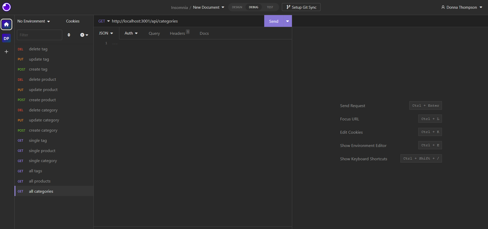

# **eCommerce Back End App**

  

  ## **Description**
  App that is a back end for an e-commerce website that uses the latest technologies so that the company can compete with other e-commerce companies.

  ## **Table of Contents:**
  * [Installation](#installation)
  * [Usage](#usage)
  * [Credits](#credits)
  * [Contribute](#contribute)
  * [Tests](#tests)
  * [License](#license)
  * [Questions](#questions)

  ## **Installation**
  Download the code for this app from https://github.com/DonnaThompson7/eCommerce-Back-End, then to start the app, on the command line, run npm install. This will create the node_modules directory in your current directory (if one doesnt exist yet) and will download the package to that directory. You can check to see if you already have node.js installed by running either the npm -v or the npm version command. Note:If there is no package.jsonfile in the local directory, the latest version of the package is installed. Connect to mysql and create the database, exit the mysql shell, then run npm seed, and run npm start

  ## **Usage**
  WHEN I add my database name, MySQL username, and MySQL password to an environment variable file, THEN I am able to connect to a database using Sequelize. WHEN I enter schema and seed commands, THEN a development database is created and is seeded with test data. WHEN I enter the command to invoke the application, THEN my server is started and the Sequelize models are synced to the MySQL database. WHEN I open API GET routes in Insomnia for categories, products, or tags, THEN the data for each of these routes is displayed in a formatted JSON. WHEN I test API POST, PUT, and DELETE routes in Insomnia, THEN I am able to successfully create, update, and delete data in my database.

  ### **Demo of how to use the eCommerce Back End App:**

  ## **Credits**
  Donna Thompson, developer. UNC Charlotte bootcamp, starter code.

  ## **Contribute**
  If you would like to contribute to this app, please follow the guidelines of The Contributor Convenant. Submit contributions to the email below.

  ## **Tests**
  Test cases: 1.GET all categories.  2.GET all products. 3.GET all tags. 4.GET a single category. 5.GET a single product. 6.GET a single tag. 7.POST, PUT, and DELETE a category. 8.POST, PUT, and DELETE a product. 9.POST, PUT, and DELETE a tag. 

  ## **License**
Licensed under [The MIT License](https://opensource.org/licenses/MIT).

  ## **Questions**
  Please visit my GitHub profile at https://github.com/DonnaThompson7   Contact me at dlthompson7@icloud.com to report issues or if you have additional questions.
